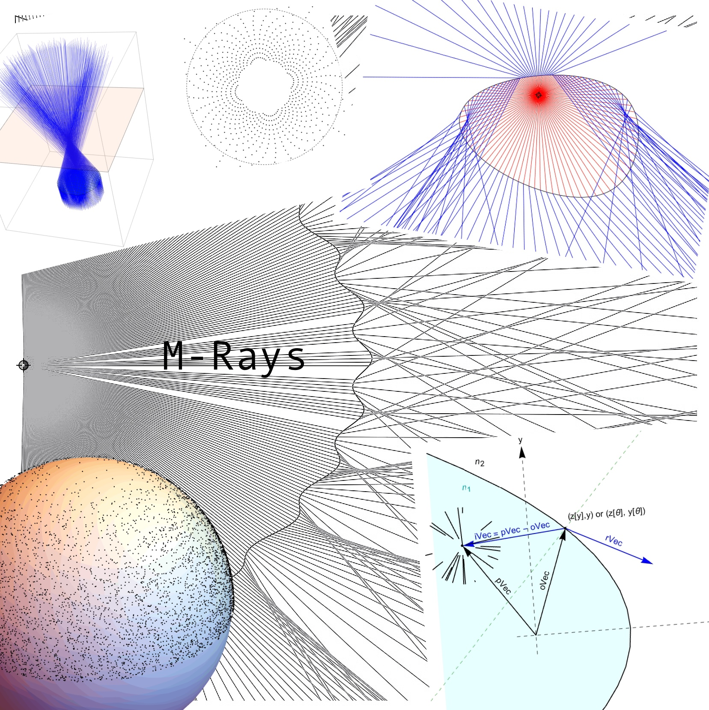

```
+------------------------------------------------------------------+
|                                                                  |
|                                                                  |
|                 ____ ___     _________ ___  _______              |
|                / __ `__ \   / ___/ __ `/ / / / ___/              |
|               / / / / / /  / /  / /_/ / /_/ (__  )               |
|              /_/ /_/ /_/  /_/   \__,_/\__, /____/                |
|                                      /____/                      |
|                                                                  |
|                                                                  |
+------------------------------------------------------------------+
```

`mrays` is a Mathematica package that can be used to determine refraction of a point light source over a surface determined either in functional or parametric form. It only considers single refraction events and deals with total internal reflection in a very limited fashion. 

The surfaces can be determined either as curves of the for z[y] or as surfaces of the form z[x,y]. It can also deal with curves given in parametric form {z[θ], y[θ]} or surfaces of the form {x[θ, ϕ], y[θ, ϕ], z[θ, ϕ]}.

